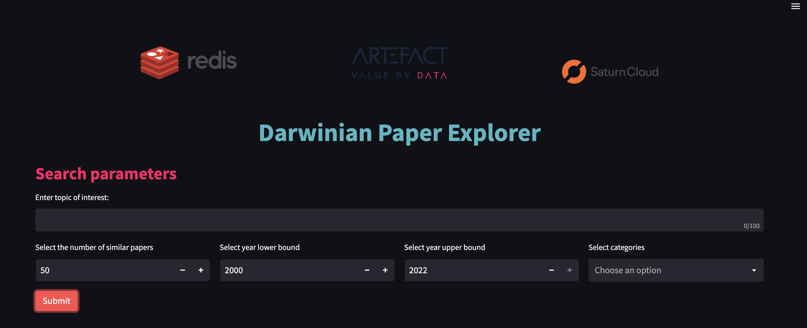

# AreYouRedis - Vector Search Engineering Hackathon 

This repository is the AreYouRedis team's hackathon submission. 

The hackathon - organised by the MLOps Community, in collaboration with Redis and Saturn Cloud - focused on Vector search engineering, on the arXiv dataset.

For more information on it, please visit the [hackathon's welcome page](https://hackathon.redisventures.com/)


### Running the app

To install requirements, run the following:

```
pip install -r requirements.txt
```

To launch the app locally,
```  
streamlit run app/app.py
```

The page below should open in your web browser:
 


### Repo structure
```
 .
├── LICENSE
├── Makefile
├── README.md
├── app
│   ├── app.py
│   ├── config_files
│   │   └── config.py
│   ├── features
│   │   └── topic_evolution.py
│   ├── main_page.py
│   ├── style
│   │   ├── Artefact_logo.png
│   │   ├── Artefact_small_logo.jpeg
│   │   ├── Redis_logo.png
│   │   ├── Saturncloud_logo.webp
│   │   └── style.css
│   └── utils
│       ├── display.py
│       ├── graph.py
│       ├── load_css.py
│       └── widgets.py
├── entrypoint.sh
├── notebooks
│   ├── custom-single-gpu-arxiv-embeddings.ipynb
│   ├── multi-gpu-arxiv-embeddings.ipynb
│   └── single-gpu-arxiv-embeddings.ipynb
├── requirements.in
├── requirements.txt
├── setup.py
└── src
    ├── categories.py
    ├── config.py
    ├── models.py
    ├── redis_db.py
    ├── scholar_citations.py
    └── vectors.py
```