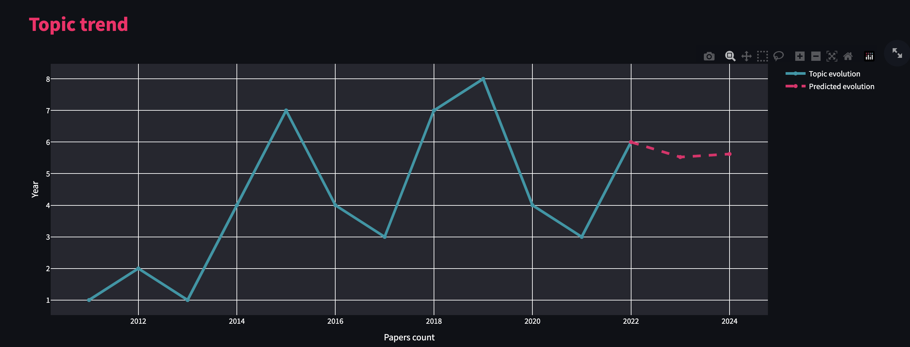
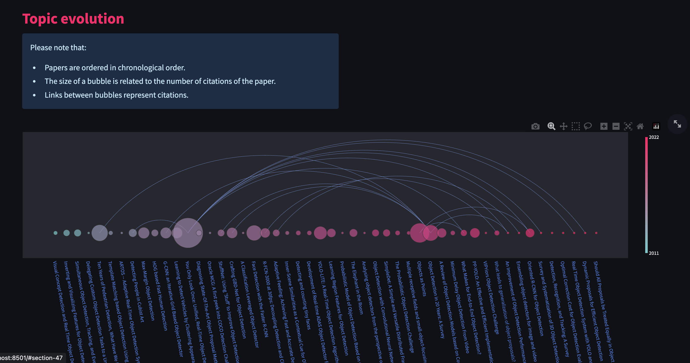
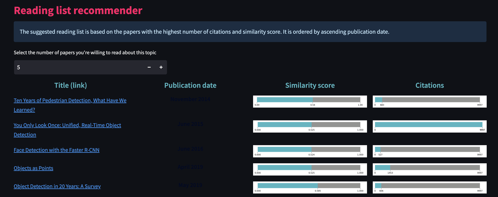
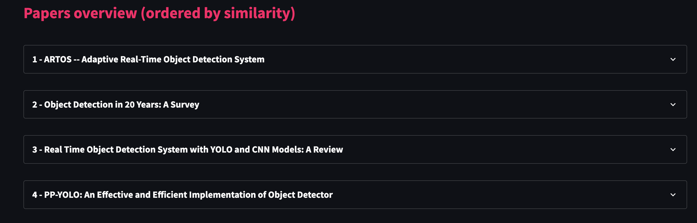
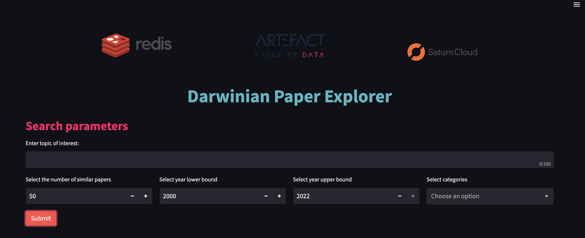

# AreYouRedis - Vector Search Engineering Hackathon 

This repository contains the code base built by the AreYouRedis team to create the "Darwinian Paper Explorer" app.

The hackathon - organised by the MLOps Community, in collaboration with Redis and Saturn Cloud - focused on Vector search engineering, on the arXiv dataset.

For more information on it, please visit the [hackathon's welcome page](https://hackathon.redisventures.com/)

## Submission summary

The submission is a streamlit app, hosted on **Saturn Cloud**, and accessible by clicking on [this link](https://pd-youss-areyouredi-ca51af7d090f4f20ab60bfc3d0e70e18.community.saturnenterprise.io/). 

The app's vision is to combine vector search and co-citations graph structures in order to:

- Help the user find arXiv articles linked to a subject he's interested in

- Provide the user with a view of a topic's trend, based on the number of related publications throughout time, along with a trend prediction for the next two years

- Illustrate how the subject of interest has evolved throughout history, with an arc diagram highlighting the founding / most influential papers and co-citation relationships between papers

- Recommend a curated reading list, based on a combination of vector similarity score and paper node degree in the citations graph


It takes as input a user's query - a sentence describing what type of arXiv papers a person is interested in searching - along with a set of filters on the year, categories, and number of similar papers to be retrieved.

Using **RedisSearch** capabilities, a set of similar articles, linked to the query, is obtained. 

Four output sections are then presented: 

1. Topic trend & future projection
 


2. Topic evolution

 

3. Reading list recommender - based on the papers' similarity scores and node degree in the citation graph

 

4. Papers overview

 


## Running locally

### 1 - Setting up the environment

First, clone the repository: 
```
git clone https://github.com/artefactory/AreYouRedis.git
```

Create a virtual environment at the root of your local repository:
```
python3 -m virtualenv .venv
source .venv/bin/activate
```

Install dependencies:
```
pip install -r requirements.txt
```

Finally, add the database's password as environment variable:
```
export REDIS_PASSWORD = '{password}'
```

### 2 - Launching the streamlit

To launch the app locally, run the following command:
```  
streamlit run app/app.py
```

The page below should open in your web browser:
 


## Repository in more details

### 1 - Preprocessing & Loading data inside the Redis DB

Going from the raw arXiv dataset to the data uploaded in redis incured several steps:

- The preprocessing operations, as long as utils function to handle the datasets, can be found in the [vector.py](https://github.com/artefactory/AreYouRedis/blob/master/src/vectors.py) script.

- Functions related to data loading, index creation & similarity search are in [redis_db.py](https://github.com/artefactory/AreYouRedis/blob/master/src/redis_db.py).

- Functions used to gather the citations (see next section) are written in [scholar_citations.py](https://github.com/artefactory/AreYouRedis/blob/master/src/scholar_citations.py).

Those different modules are called in the [custom-single-gpu-arxiv-embeddings.ipynb](https://github.com/artefactory/AreYouRedis/blob/master/notebooks/custom-single-gpu-arxiv-embeddings.ipynb) notebook, where datasets are gathered, cleaned, merged and loaded into Redis.

### 2 - Data enrichment

To better understand the origin & links between different articles, we chose to gather their citations - i.e. all other arXiv papers cited in one article.

For this, we used [Semantic Scholar](https://www.semanticscholar.org/), an online research tool focused on scientific literature.
We worked specifically with the [python API](https://pypi.org/project/semanticscholar/), to query the citations.


### 3 - Topic evolution

Finally, the code used to generate the different graphs (topic evolution, prediction of the trend & arc graph) can be found in the [topic evolution](https://github.com/artefactory/AreYouRedis/blob/master/app/features/topic_evolution.py) script.

### Repository Structure

```
 .
├── LICENSE
├── Makefile
├── README.md
├── app
│   ├── app.py
│   ├── config_files
│   │   └── config.py
│   ├── features
│   │   └── topic_evolution.py
│   ├── main_page.py
│   ├── style
│   │   ├── Artefact_logo.png
│   │   ├── Artefact_small_logo.jpeg
│   │   ├── Redis_logo.png
│   │   ├── Saturncloud_logo.webp
│   │   └── style.css
│   └── utils
│       ├── display.py
│       ├── graph.py
│       ├── load_css.py
│       └── widgets.py
├── entrypoint.sh
├── notebooks
│   ├── custom-single-gpu-arxiv-embeddings.ipynb
│   ├── multi-gpu-arxiv-embeddings.ipynb
│   └── single-gpu-arxiv-embeddings.ipynb
├── requirements.in
├── requirements.txt
├── setup.py
└── src
    ├── categories.py
    ├── config.py
    ├── models.py
    ├── redis_db.py
    ├── scholar_citations.py
    └── vectors.py
```